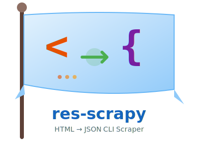

# res-scrapy

<div align="center">
  
</div>

[](https://www.npmjs.com/package/res-scrapy)


> **The CLI tool that turns HTML into structured JSON with zero code.**

Extract data from any HTML source—websites, files, or API responses—using simple CSS selectors or powerful JSON schemas. Built with ReScript for reliability and speed.

## Why res-scrapy?

- **Zero-code data extraction** – No programming required, just CSS selectors
- **11 built-in field types** – Text, numbers, booleans, dates, URLs, JSON, lists, and more
- **Multi-page URL fetching** – Scrape paginated sites with `{start..end}` templates, custom headers, rate limiting, and proxy support
- **Table mode** – Convert HTML tables to JSON instantly
- **Schema-driven** – Reusable, version-controlled extraction configs
- **Pipe-friendly** – Works seamlessly with `curl`, `cat`, and other CLI tools

## Installation

```bash
npm install -g res-scrapy
```

Or use without installing:

```bash
npx res-scrapy -h
```

> [!NOTE]
> Requirements: Node.js >= 22.0.0

## Quick Start Examples

### 1. Extract text with a CSS selector

```bash
# Extract text from the first <h1>
curl -s https://example.com | res-scrapy -s 'h1' -e text
# ["Welcome to Example"]
```

### 2. Extract all links

```bash
curl -s https://example.com | res-scrapy -s 'a' -m -e 'attr:href'
# ["https://example.com/about", "https://example.com/contact"]
```

### 3. Scrape multiple pages with URL templates

```bash
res-scrapy \
 --url 'https://books.toscrape.com/catalogue/page-{1..50}.html' \
 --user-agent 'MyBot/1.0' --delay 200 --timeout 15 \
 -s 'h3' -e text -m -j 20
```

### 4. Multi-page URL ranges: {start..end}, with concurrency and output options

```bash
res-scrapy --url 'https://books.toscrape.com/catalogue/page-{1..5}.html' -s 'h3' -m --output books.json
```

## CLI Reference

```

Usage: res-scrapy [options]

Options:
-v, --version Display CLI version
-h, --help Display help message
-s, --selector CSS selector to target element(s)
-m, --mode Extract multiple results (single by default)
-e, --extract What to extract: outerHtml, innerHtml, text, or attr:<name>
-c, --schema Inline JSON schema for structured extraction
-p, --schemaPath Path to JSON schema file
-t, --table Extract HTML table as JSON array
-o, --output Write results to a file instead of stdout
-f, --format Output format for file writes: json (default) or ndjson
-u, --url URL template (e.g. "https://site.com/page-{1..10}.html")
-j, --concurrency Max concurrent fetches (default: 5, max: 20)
--user-agent Custom User-Agent header (default: "res-scrapy/{version}")
--timeout Request timeout in seconds (default: 30, min: 1)
--retry Max retries on failure (default: 3, min: 1)
--delay Minimum delay between request starts in ms (default: 0)
--header Custom HTTP header in "Key: Value" format (repeatable)
--cookie Cookie value (repeatable, sugar for --header)
```

## Key Features

### 10 Field Types for Semi-Structured Data Extraction

| Type        | Purpose                   | Example Use Case               |
| ----------- | ------------------------- | ------------------------------ |
| `text`      | Extract text content      | Product names, descriptions    |
| `attribute` | Extract HTML attributes   | `href`, `src`, `data-*`        |
| `html`      | Extract raw HTML markup   | Preserving formatting          |
| `number`    | Parse numeric values      | Prices with currency stripping |
| `boolean`   | Convert to true/false     | Stock status, availability     |
| `datetime`  | Parse and normalize dates | Published dates, timestamps    |
| `url`       | Extract and resolve URLs  | Absolute links from relative   |
| `json`      | Parse embedded JSON-LD    | Schema.org data                |
| `list`      | Collect multiple values   | Tags, categories               |
| `count`     | Count matching elements   | Review counts, item totals     |

### Table Mode

Quickly convert HTML tables to JSON without writing schemas:

```bash
cat page.html | res-scrapy --table --selector '#data-table'
```

### Row-Based Extraction (Recommended)

Use `config.rowSelector` to extract repeating items like product cards or search results. Each row becomes a JSON object with fields evaluated relative to that row.

```json
{
  "config": { "rowSelector": ".job-card" },
  "fields": {
    "title": { "selector": "h2", "type": "text" },
    "company": { "selector": ".company", "type": "text" }
  }
}
```

## Documentation

📖 **Full docs at [metalbolicx.github.io/res-scrapy](https://metalbolicx.github.io/res-scrapy/)**

- [Getting Started](https://metalbolicx.github.io/res-scrapy/#/getting-started)
- [Schema Guide](https://metalbolicx.github.io/res-scrapy/#/schema-guide)
- [Examples](https://metalbolicx.github.io/res-scrapy/#/examples)
- [Changelog](./CHANGELOG.md)

## Development

Clone and build from source:

```bash
git clone https://github.com/MetalbolicX/res-scrapy.git
cd res-scrapy
pnpm install
pnpm run res:build
```

## License

Released under [MIT](/LICENSE) by [@MetalbolicX](https://github.com/MetalbolicX).

---

**Built with** [ReScript](https://rescript-lang.org/) · **Powered by** [node-html-parser](https://github.com/taoqf/node-html-parser)
