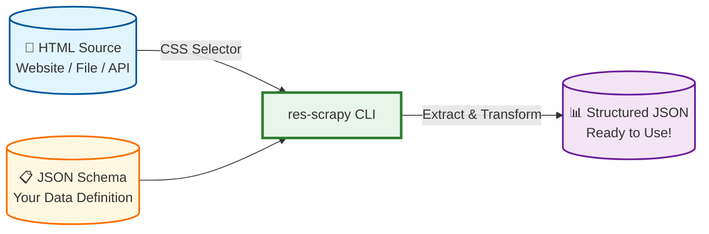

# res-scrapy

Hey there! 👋 If you've ever found yourself copy-pasting data from websites, writing fragile regex patterns, or maintaining Python scripts that break every time a site redesigns, you're in the right place. res-scrapy is here to make web scraping feel less like archaeology and more like... well, just asking for the data you want.

## What Problem Does `res-scrapy` Solve?

Let's be honest: extracting data from HTML is usually a pain. You have three options, and none of them are great:

1. **Manual copy-paste** — Tedious, error-prone, and doesn't scale
2. **Custom scripts** — Write Python/Node.js code, handle edge cases, debug selectors, maintain it when the site changes
3. **Heavyweight frameworks** — Overkill for simple tasks, steep learning curve

res-scrapy offers a **fourth option**: a lightweight CLI tool that speaks your language (CSS selectors!) and handles the messy parts automatically. You define _what_ you want in a simple JSON schema, and res-scrapy figures out _how_ to get it.

## The Magic: HTML → Schema → JSON

Here's how it works:

**The beauty?** You write the schema once, and it works everywhere. Need to scrape product listings from an e-commerce site? Define a schema with `rowSelector: ".product-card"` and let res-scrapy handle the rest. Want to extract tables? Just add `--table` flag. It's that simple.

## Why We Built It This Way

### Flexible Schemas for Every Use Case

Not all data is created equal, and res-scrapy gets that. Whether you're dealing with:

- **Product catalogs** with prices, images, and stock status
- **Job listings** with titles, companies, and locations
- **News articles** with headlines, authors, and publish dates
- **Tables** full of statistics
- **Nested JSON-LD** embedded in scripts

...there's a field type for that. With **10 built-in types**—text, number, boolean, datetime, url, attribute, html, json, list, and count—you can model virtually any data structure. And with `rowSelector`, you can extract repeating elements (like product cards) correctly every time.

### Why ReScript?

You might be wondering: _"Why build this in ReScript?"_ Great question!

ReScript is a robust, type-safe language that compiles to blazing-fast JavaScript. For a CLI tool like res-scrapy, this means:

- **Type safety** — Catch errors at compile time, not when scraping
- **Performance** — Fast startup and execution, even with large HTML files
- **Maintainability** — Refactor with confidence as the codebase grows
- **Reliability** — No runtime surprises when you're processing critical data

It's the same philosophy as Rust or Go, but for the JavaScript ecosystem. We wanted a tool that's both **pleasant to use** and **rock-solid reliable**.

## How Does It Compare?

Unlike **pup** (which requires Go knowledge) or **BeautifulSoup** (which needs Python setup), res-scrapy is a standalone CLI tool that works anywhere Node.js runs—no language-specific ecosystem required. Compared to **jq** (which transforms JSON, not HTML), res-scrapy handles the full pipeline from messy markup to clean data.

## Ready to Dive In?

- 📖 **[Getting Started](getting-started.md)** — Installation and your first scrape
- 📋 **[Schema Guide](schema-guide.md)** — Master the art of data extraction
- 💡 **[Examples](examples.md)** — Real-world patterns and use cases
- 🚀 **[Release Process](release-process.md)** — Versioning and publishing workflow

Let's turn that HTML into something useful! 🚀
