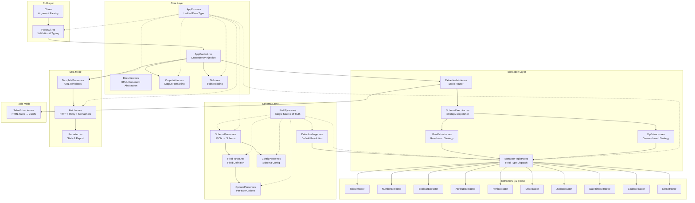
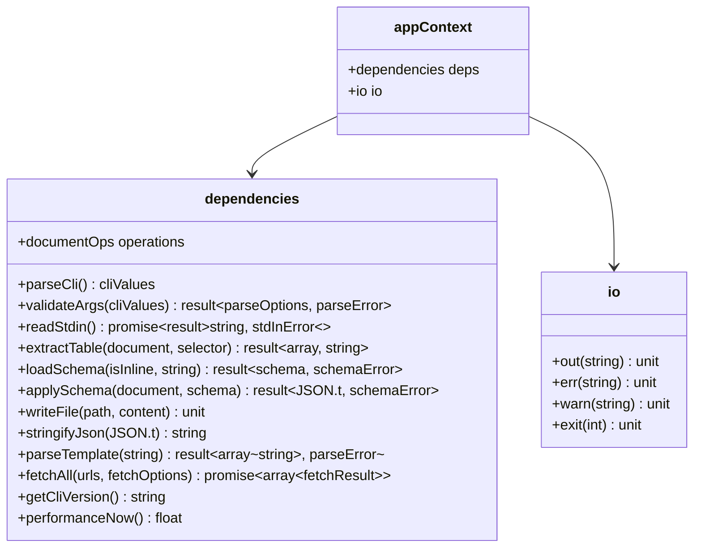
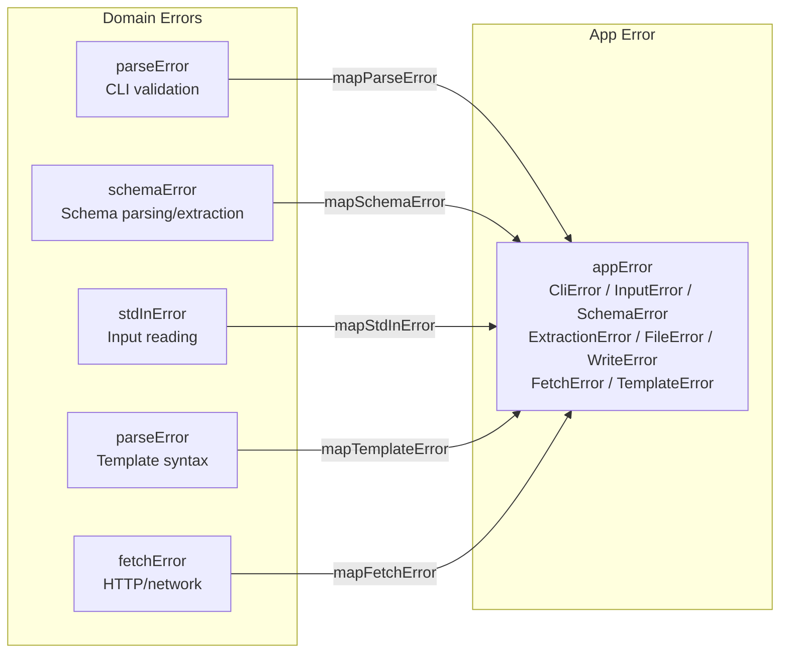
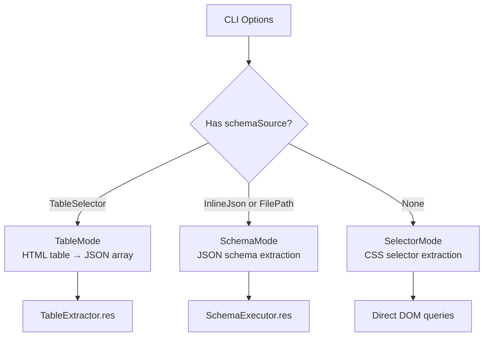
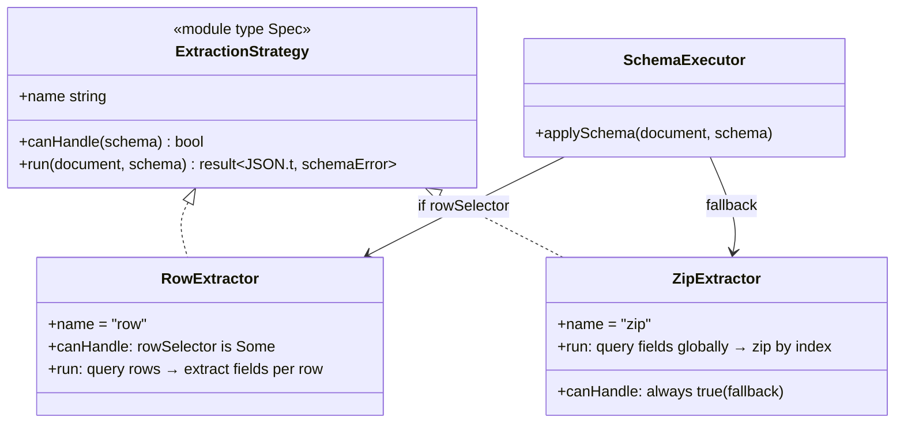
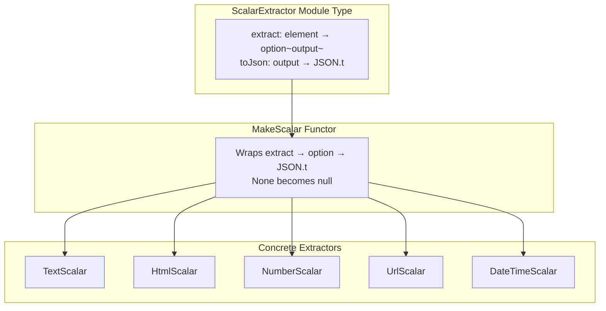
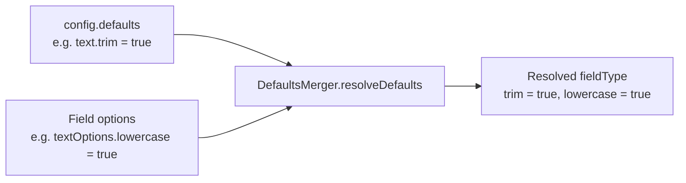
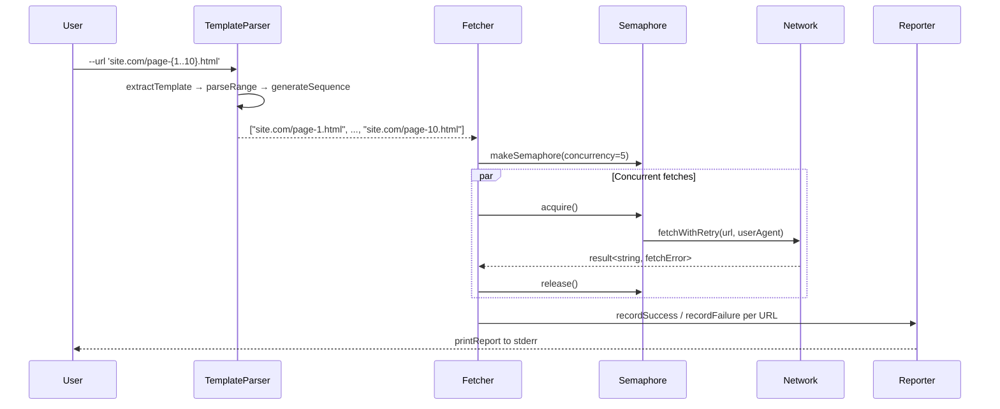
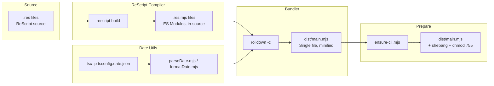
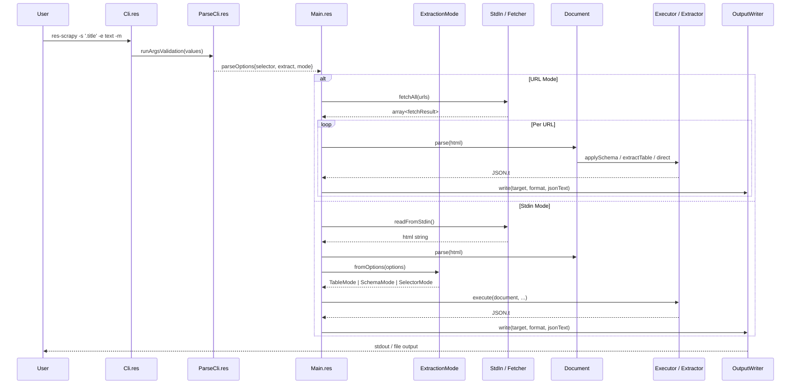

# `res-scrapy` — Architecture & Design Decisions

Reverse-engineered documentation of the architectural decisions, patterns, and data flows
in the `res-scrapy` CLI scraper.

---

## 1. Technology Stack Decision: Why ReScript?

**Decision:** The entire CLI is written in [ReScript](https://rescript-lang.org/), a typed language that compiles to JavaScript.

**Rationale:**

- **Type safety without runtime overhead** — ReScript compiles to clean, readable JavaScript with zero runtime cost. The type system catches errors at compile time, which is critical for a data extraction tool where malformed schemas or unexpected HTML structures are common.
- **Exhaustive pattern matching** — The `switch` expressions used throughout (e.g., field type dispatch, error mapping) guarantee that every variant is handled. This prevents silent failures in extraction.
- **Interop with Node.js** — ReScript's `@module`, `@val`, `@send` externals provide type-safe bindings to Node.js APIs (`node:util`, `node:fs`, `fetch`, `node-html-parser`) without a heavy FFI layer.
- **Immutable by default** — All data structures are immutable, which simplifies reasoning about the extraction pipeline. Mutation is explicit via `ref` (e.g., `stats`, `acc` accumulators).

**Tradeoff:** The ReScript ecosystem is small. The project compensates by writing thin bindings (`NodeJsBinding.res`, `NodeHtmlParserBinding.res`) to the exact Node.js surface needed.

---

## 2. High-Level Architecture



---

## 3. Dependency Injection via AppContext

**Decision:** All side effects are funneled through a single `appContext` record, acting as a composition root.



**Rationale:**

- **Testability** — Every dependency can be replaced in tests. The `mainWithContext` function accepts an `appContext`, so tests inject mocks for `parseCli`, `readStdin`, `documentOps`, etc.
- **Production wiring** — `AppContext.production` wires real implementations (`Cli.parse`, `StdIn.readFromStdin`, `NodeHtmlDocument.operations`, etc.).
- **No global state** — The only global mutation is `process.exitCode` and the runtime error handlers, both registered once at startup.

**Pattern:** This is a manual implementation of the **Dependency Injection** pattern without a framework. The `dependencies` record acts as a service locator, and `io` isolates all console/process output.

---

## 4. Document Abstraction Layer

**Decision:** HTML parsing is abstracted behind a `Document.operations` record.

```rescript
type operations = {
  parse: string => document,
  querySelector: (document, string) => option<element>,
  querySelectorAll: (document, string) => array<element>,
  getAttribute: (element, string) => option<string>,
  textContent: element => string,
  innerHTML: element => string,
  outerHTML: element => string,
  tagName: element => string,
}
```

**Rationale:**

- The project uses `node-html-parser` as its HTML parser, but the core logic never references it directly.
- `NodeHtmlDocument.res` provides the production implementation; tests can substitute a mock.
- This abstraction enables swapping the parser (e.g., to `linkedom` or `cheerio`) without touching extraction logic.

---

## 5. Error Handling Strategy

**Decision:** A unified `appError` variant type with domain-specific error mappers.



**Rationale:**

- Each module defines its own error type (e.g., `parseError`, `schemaError`, `fetchError`) for precise pattern matching at the module boundary.
- `AppError.res` provides mapper functions that convert domain errors into the top-level `appError` type.
- `Main.res` uses `ResultX.mapError` to chain these mappers, keeping error propagation explicit and type-safe.
- `ResultX.res` extends the standard `result` type with `mapError`, `flatMap`, `flatten`, and `bimap` — functional combinators that eliminate nested `switch` blocks.

---

## 6. Three Extraction Modes

**Decision:** The CLI supports three mutually exclusive extraction modes, resolved by `ExtractionMode.fromOptions`:



### 6.1 Selector Mode (default)

- Simple CSS selector + extract mode (text, innerHTML, outerHTML, attribute).
- Single or multiple element matching.
- Output is a JSON array of strings.

### 6.2 Schema Mode

- A JSON schema defines fields, selectors, types, and options.
- Supports 11 field types: text, number, boolean, attribute, html, url, json, datetime, count, list, table.
- Two extraction strategies: **Row** and **Zip** (see §7).

### 6.3 Table Mode

- Quick extraction of HTML `<table>` elements.
- Headers from `<thead> <th>` or first `<tr> <th>`.
- Rows from `<tbody> <tr>` or all `<tr>` except the first.
- Output is a JSON array of objects keyed by header text.

---

## 7. Schema v2: Strategy Pattern for Extraction

**Decision:** Schema extraction uses the **Strategy Pattern** via ReScript module functions.



### Row Strategy (`RowExtractor.res`)

- Activated when `schema.config.rowSelector` is set.
- Queries all row elements first, then evaluates each field selector **relative to each row**.
- Produces one JSON object per row element.
- Boolean `Presence` mode returns `false` when the sub-selector finds nothing within a row.

### Zip Strategy (`ZipExtractor.res`)

- Default when no `rowSelector` is set (always `canHandle = true`).
- Each field selector runs against the **document root** independently.
- Rows are produced by **zipping element lists by index** (column-oriented).
- Aggregate fields (`Count`, `List`) produce a single value repeated across all output rows.
- Edge case: if all fields are aggregate and no `rowSelector`, output is an empty array.

**Rationale for two strategies:**

- **Row mode** is semantically correct for structured data (e.g., product cards, table rows with sub-selectors).
- **Zip mode** handles flat, parallel lists (e.g., `.title` and `.price` selectors that each match N elements in the same order).
- The strategy is selected automatically based on the schema — no user flag needed.

---

## 8. Extractor Registry: Functor-Based Dispatch

**Decision:** Individual field type extractors are dispatched through a registry that uses ReScript **module functors**.



**How it works:**

1. Each extractor implements `ScalarExtractor` with `extract` (returns `option`) and `toJson`.
2. `MakeScalar` functor wraps this into a `run` function that handles `None → null`.
3. `ExtractorRegistry.res` dispatches `fieldType` variants to the appropriate scalar module.
4. Multi-element types (`Count`, `List`, `Table`) bypass the scalar path and receive the full element array.

**The 11 field types:**

| Type        | Extractor            | Output | Notes                                              |
| ----------- | -------------------- | ------ | -------------------------------------------------- |
| `Text`      | `TextExtractor`      | string | trim, normalize, case, pattern, join               |
| `Number`    | `NumberExtractor`    | float  | strip non-numeric, precision, separators           |
| `Boolean`   | `BooleanExtractor`   | bool   | mapping, presence, attribute-check modes           |
| `Attribute` | `AttributeExtractor` | string | single/multi attribute, join mode                  |
| `Html`      | `HtmlExtractor`      | string | inner/outer, strip scripts/styles                  |
| `Url`       | `UrlExtractor`       | string | resolve relative, validate, strip query/hash       |
| `Json`      | `JsonExtractor`      | JSON.t | parse embedded JSON from text/attribute            |
| `DateTime`  | `DateTimeExtractor`  | string | ISO-8601, epoch, custom format                     |
| `Count`     | `CountExtractor`     | int    | counts matched elements                            |
| `List`      | `ListExtractor`      | array  | collects text/html/attribute/url from sub-elements |
| `Table`     | (inline)             | array  | nested table extraction within a row               |

---

## 9. Defaults Merging

**Decision:** Schema-level `config.defaults` are merged with per-field options using `DefaultsMerger.res`.

**Merge strategy:** Per-field options **always win**. Schema defaults fill in unset fields.



This allows DRY schemas where common options (e.g., `trim: true` for all text fields) are set once in `config.defaults`.

---

## 10. URL Mode: Template Expansion + Concurrent Fetching

**Decision:** URL mode uses a custom template parser and a hand-rolled concurrency system.



### Template Parser (`TemplateParser.res`)

- Supports `{start..end}` and `{start..end..step}` range syntax.
- Auto-detects zero-padding from the start value (e.g., `{01..10}` → `01, 02, ..., 10`).
- Single template per URL (multiple templates are rejected with an error).

### Fetcher (`Fetcher.res`)

- **Timeout:** 30 seconds per request via `AbortController`.
- **Retry:** 3 attempts with exponential backoff (1s, 2s, 4s) + random jitter (±500ms).
- **Retryable errors:** Network errors, timeouts, HTTP 429 (rate limit), HTTP 5xx (server errors).
- **Concurrency:** Hand-rolled semaphore (no external dependency). Hard cap at 20 concurrent requests.
- **User-Agent:** `res-scrapy/{version}`.

### Reporter (`Reporter.res`)

- Tracks: attempted, succeeded, failed, rows extracted, duration.
- Prints a summary report to stderr after all fetches complete.
- Exit code: 0 if any succeeded, 1 if all failed.

### Streaming vs Buffering

- **stdout:** Always streams NDJSON (one JSON object per line) for immediate output.
- **File + NDJSON:** Streams rows by appending incrementally.
- **File + JSON:** Buffers all results, then writes a single JSON array at the end.

---

## 11. Build Pipeline



**Key decisions:**

- **ES Modules throughout** — `rescript.json` sets `"module": "esmodule"` and `"in-source": true`, so `.res.mjs` files sit next to `.res` files.
- **Rolldown** (not Rollup or esbuild) as the bundler — chosen for speed and ESM-native support. Externalizes `node:*`, `node-html-parser`, and `@rescript/runtime`.
- **TypeScript for date utils** — `parseDate.mts` and `formatDate.mts` are compiled separately via `tsc` because date manipulation is easier in TS than ReScript. The compiled `.mjs` files are committed to source and checked in CI (`date:check`).
- **`ensure-cli.mjs`** — Post-bundle script that adds the `#!/usr/bin/env node` shebang and sets `chmod 755` on the output.
- **No build step after `res:clean`** — The `res:clean` command only deletes compiled `.res.mjs` files; it does not touch `dist/`.

---

## 12. Module Organization

```
src/
├── Main.res                    # Entry point, orchestration
├── Main.resi                   # Public interface (main, mainWithContext)
├── bindings/
│   ├── NodeJsBinding.res       # Node.js API bindings (fs, util, fetch, process, Iterator)
│   └── NodeHtmlParserBinding.res  # node-html-parser bindings
├── cli/
│   ├── Cli.res                 # Help text, argument parsing via node:util.parseArgs
│   └── ParseCli.res            # Validation, typed parseOptions
├── core/
│   ├── AppContext.res           # Dependency injection container
│   ├── AppError.res             # Unified error type + mappers
│   ├── Document.res             # HTML document abstraction
│   ├── ExnUtils.res             # Exception message extraction
│   ├── NodeHtmlDocument.res     # Production Document.operations
│   ├── OutputWriter.res         # Stdout/file output, JSON/NDJSON
│   └── ResultX.res              # Result combinators (mapError, flatMap, bimap)
├── extraction/
│   └── ExtractionMode.res       # Mode router (Table | Schema | Selector)
├── schema/
│   ├── Schema.res               # Public API facade (delegates to v2)
│   └── v2/
│       ├── SchemaV2.res         # loadSchema, applySchema
│       ├── executor/
│       │   ├── ExtractionStrategy.res  # Strategy module type + Make functor
│       │   ├── RowExtractor.res        # Row-based extraction
│       │   ├── SchemaExecutor.res      # Strategy dispatcher
│       │   └── ZipExtractor.res        # Column-based extraction
│       ├── extractors/
│       │   ├── AttributeExtractor.res
│       │   ├── BooleanExtractor.res
│       │   ├── CountExtractor.res
│       │   ├── DateTimeExtractor.res
│       │   ├── DefaultsMerger.res      # Schema defaults → field options
│       │   ├── ExtractorRegistry.res   # Central dispatch + MakeScalar functor
│       │   ├── HtmlExtractor.res
│       │   ├── JsonExtractor.res
│       │   ├── ListExtractor.res
│       │   ├── NumberExtractor.res
│       │   ├── TextExtractor.res
│       │   └── UrlExtractor.res
│       ├── parser/
│       │   ├── ConfigParser.res        # Schema config + defaults parsing
│       │   ├── FieldParser.res         # Single field definition parsing
│       │   ├── OptionsParser.res       # Per-type options parsing
│       │   └── SchemaParser.res        # Top-level schema → typed schema
│       ├── types/
│       │   └── FieldTypes.res          # Single source of truth for all types
│       └── utils/
│           ├── DateUtils.res
│           ├── JsonUtils.res           # dictGet helper
│           ├── NumberUtils.res
│           ├── StringUtils.res
│           └── date/                   # TypeScript date helpers
├── stdio/
│   └── StdIn.res                # Stdin reading with timeout + size limits
├── table/
│   └── TableExtractor.res       # HTML table → JSON array
└── url/
    ├── Fetcher.res              # HTTP fetch + retry + semaphore
    ├── Reporter.res             # URL mode stats reporting
    └── TemplateParser.res       # URL template expansion
```

---

## 13. Key Design Patterns Summary

| Pattern                       | Where                                                    | Why                                          |
| ----------------------------- | -------------------------------------------------------- | -------------------------------------------- |
| **Dependency Injection**      | `AppContext.res`                                         | Testability, no global state                 |
| **Strategy Pattern**          | `ExtractionStrategy.res`, `RowExtractor`, `ZipExtractor` | Two extraction algorithms, auto-selected     |
| **Functor (Module Function)** | `MakeScalar` in `ExtractorRegistry.res`                  | Uniform wrapper for heterogeneous extractors |
| **Facade**                    | `Schema.res` → `SchemaV2.res`                            | Backwards-compatible API surface             |
| **Result Monad**              | `ResultX.res`                                            | Composable error propagation                 |
| **Adapter**                   | `Document.res`, `NodeHtmlDocument.res`                   | Swappable HTML parser                        |
| **Template Method**           | `ExtractionStrategy.Make`                                | Defines skeleton, injects concrete behavior  |

---

## 14. Data Flow: End-to-End



---

## 15. Notable Constraints & Tradeoffs

1. **Node.js ≥ 22 required** — Uses `Iterator` helpers, `parseArgs`, global `fetch`, and top-level `await`.
2. **No streaming HTML parsing** — `node-html-parser` loads the entire document into memory. Fine for typical web pages; problematic for very large documents.
3. **Single-threaded** — Concurrency is cooperative (Promise-based semaphore), not parallel. CPU-bound extraction runs sequentially.
4. **TypeScript date helpers** — Date parsing/formatting is implemented in TypeScript and compiled to `.mjs`, committed to source. This is a pragmatic compromise for complex date logic.
5. **`%raw` usage** — A few `%raw` blocks exist for things ReScript can't express (e.g., `import.meta.url` detection, `process` global handlers, JSON parsing). These are isolated and documented.
6. **Schema v1 → v2 migration** — `Schema.res` is a thin facade that delegates to `SchemaV2`. The v2 parser supports both object and array field formats for backwards compatibility.
