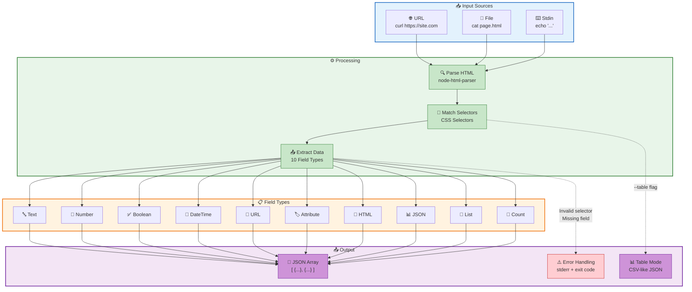

# res-scrapy Workflow

This diagram illustrates the complete data flow through res-scrapy:

## 1. **Input Sources** (Blue)

HTML can come from anywhere:

- **URL**: Pipe curl output directly
- **File**: Read local HTML files
- **Stdin**: Echo or pipe HTML content

## 2. **Processing** (Green)

Three-stage pipeline:

- **Parse**: HTML is parsed into a traversable DOM
- **Select**: CSS selectors find target elements
- **Extract**: Data is extracted and transformed

## 3. **Field Types** (Orange)

10 powerful extraction types:

- **Text**: Clean text content
- **Number**: Parsed with currency stripping
- **Boolean**: True/false logic
- **DateTime**: Normalized dates
- **URL**: Resolved and validated links
- **Attribute**: Any HTML attribute
- **HTML**: Raw markup
- **JSON**: Embedded JSON-LD
- **List**: Arrays of values
- **Count**: Element counts

## 4. **Output** (Purple)

Flexible output options:

- **JSON Array**: Structured objects
- **Table Mode**: Quick table extraction
- **Error Handling**: Clear errors to stderr

## Key Features Shown

- 🔄 **Multi-source input**: URL, file, or stdin
- 🎯 **Schema-driven**: Define once, use everywhere
- 📊 **Type safety**: Automatic parsing and validation
- ⚡ **Fast**: Built for speed with ReScript
- 🛡️ **Reliable**: Proper error handling

---
